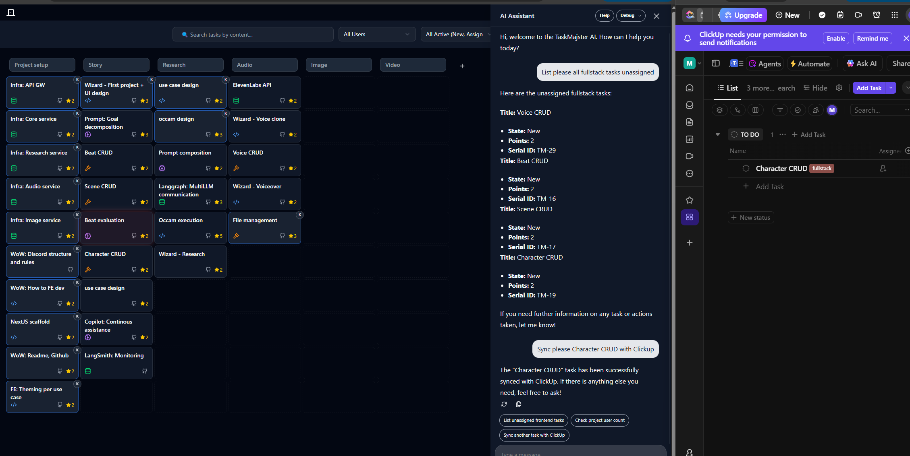

Task management app for a hackathon event. The goal is to manage work without communication overhaul to 5-10 devs never met before, with 100+ tasks broke down into feature streams.

- Team lead is able to effectively create new tasks and manage project
- Dev is able to quickly assign free task based on his skillset and interest



## Features
Simple and effective backlog management via large grid with tasks

- Basic task state workflow and attributes for easy categorization
- Chat to manage large amount of tasks using CopilotKit
- Automatically changes state via Github PR activities
- Sync tasks into Clickup to provide more details about tasks

## Architecture
- UI: **NextJS**, Typescript, Tailwind 4.x with Shadcn components
- Backend: **Supabase** table with Edge **functions**
- Integrations: **Github** Webhooks to sync PRs, **Clickup** task management API
  
## Run your own project locally
### Client server
```bash
git clone tbd
npm install
npm run dev
```
### Supabase
-- TBD provide latest scripts to create tables and edge functions
#### Github webhook
Optional feature to synchronize PR events with the app

Github repo instructions
1. Go to `Settings > Webhooks > Add webhook`
2. Set the **Payload URL** to your **Supabase function URL**
3. Set **Content type** to `application/json`
4. Set **Secret** to the same value as ``GITHUB_WEBHOOK_SECRET`
5. Select **events**: *Pull requests* and *Pull request reviews*

Pull Request Guidelines
- All PRs should be linked to a task using one of these methods:
- Preferred: Include Task ID in PR Title
```bash
Format: `[TM-{id}] {brief description}`
Example: `[TM-abc123] Add user filtering component`
```

- Alternative: Include Task ID in PR Description

#### Impact on default workflow
The system will automatically update task status based on PR events:
- Creating a PR will change task status to "in review"  
- Approving a PR will change status to "reviewed"
- Merging a PR will change status to "completed"

### Clickup
#### Setup workspace 
- TBD How to Clickup app
#### Mapping Clickup structure with TaskMajster columns
- TBD How to API key, mapping lists with TaskMajster columns
